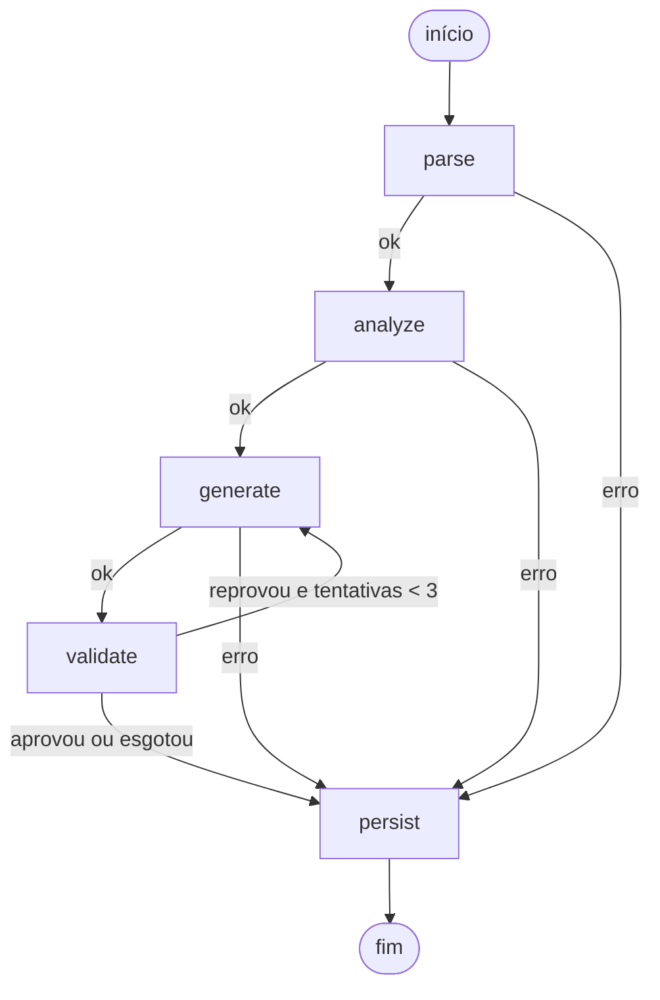

# Modernizer: pipeline híbrida PL/pgSQL → Python 3.14

Pipeline que recebe uma stored procedure PL/pgSQL e devolve um módulo Python 3.14
equivalente, com um relatório das decisões e validações. É híbrida: etapas
determinísticas (parsing, análise, validação) cercam uma etapa de LLM (geração).

## Como funciona



| Nó | Tipo | O que faz |
|---|---|---|
| `parse` | regras | Extrai assinatura (sqlglot) e árvore procedural (pglast) |
| `analyze` | regras | Conta construções, lista tabelas e funções chamadas, e marca riscos de tradução com uma orientação para cada um |
| `generate` | LLM | Gera o módulo Python a partir de um prompt montado com as saídas dos dois nós anteriores |
| `validate` | regras | Sintaxe (`ast.parse`), estrutura, lint (ruff) e execução em banco de teste |
| `persist` | regras | Grava a execução em `modernization_history`, qualquer que seja o desfecho |

O estado do grafo é um `TypedDict` (`src/modernizer/graph/state.py`). Todo caminho
termina em `persist`, o que garante o registro de sucessos, falhas e parciais.

Quando a validação reprova, o grafo volta para `generate` com o código rejeitado e
os erros no prompt, até 3 tentativas.

## Como executar

Pré-requisitos: Docker, Python 3.14, [uv](https://docs.astral.sh/uv/) e uma chave
do Google AI Studio.

```bash
cp .env.example .env        # preencha GEMINI_API_KEY
docker compose up -d        # Postgres: bancos modernizer (histórico) e legacy (teste)
uv sync
uv run langgraph dev        # servidor em http://127.0.0.1:2024
```

| Variável | Uso |
|---|---|
| `GEMINI_API_KEY` | Chave do Google AI Studio |
| `MODERNIZER_MODEL` | Modelos em ordem de preferência, separados por vírgula |
| `DATABASE_URL` | Banco do histórico |
| `TEST_DATABASE_URL` | Banco de teste da validação por execução (opcional) |

Endpoints:

- `GET /health` devolve `{"status": "ok"}`
- `POST /modernize` recebe `{"source_code": "...", "schema_ddl": "...", "dialect": "postgres"}`
  e devolve `id`, `status`, `generated_code` e `report`

Para rodar os Anexos B a F e salvar em `results/`:

```bash
uv run python scripts/run_samples.py
```

## Resultados

Código gerado e relatório de cada anexo estão em `results/`.

| Anexo | Rotina | Status | Checks |
|---|---|---|---|
| B | `fn_saldo_cliente` | sucesso | sintaxe, estrutura, lint |
| C | `sp_atualizar_status_contas_inativas` | sucesso | sintaxe, estrutura, lint |
| D | `sp_transferir_entre_contas` | sucesso | + execução |
| E | `sp_processar_lote_taxas` | sucesso | + execução |
| F | `sp_relatorio_mensal_cliente` | sucesso | sintaxe, estrutura, lint |

## Decisões técnicas

**Parsing com duas bibliotecas.** Uma procedure tem duas camadas. O sqlglot extrai
bem a assinatura (nome, modo e tipo dos parâmetros, retorno) e é multi-dialeto, mas
trata o corpo como texto. O pglast é o parser real do PostgreSQL e devolve a árvore
procedural (`IF`, `LOOP`, cursores, `EXCEPTION`), mas perde a precisão dos tipos.
Uso cada um no que faz melhor. Descartei o sqlparse por ser apenas um tokenizador.

**SQL fica no banco, controle vai para o Python.** Operações sobre dados continuam
em SQL parametrizado, enviadas com psycopg 3. Validações, exceções, transação e
logs passam para o Python. Reescrever consultas em laços criaria N+1; manter tudo
em SQL não seria modernização. Escolhi psycopg em vez de SQLAlchemy por ser mais
fino: transação e savepoint explícitos, `NUMERIC` como `Decimal`.

**Riscos detectados por regras, não pelo LLM.** A análise tem uma tabela de regras
(`dialects/postgres.py`): cursor em laço, bloco `EXCEPTION`, `FOR UPDATE`, parâmetros
OUT, CTE recursiva, `NUMERIC`, JSONB e outras. Cada risco leva uma orientação que
entra no prompt. O LLM recebe a instrução pronta em vez de precisar notar o problema.

**Validação por execução.** Sintaxe e lint aprovam código que não roda. Durante o
desenvolvimento, módulos com status de sucesso quebravam em tempo de execução
(`Decimal` em JSON, parâmetro sem tipo em `jsonb_build_object`, cursor reutilizado
dentro do laço). A validação passou a executar a função contra um banco de teste,
com argumentos derivados dos tipos dos parâmetros, em transação sempre desfeita. O
erro de execução volta para o LLM na tentativa seguinte.

**Provedor de LLM atrás de uma interface.** O nó conhece apenas `LLMProvider`. A
implementação atual usa Gemini com saída estruturada (JSON com `code` e `decisions`),
lista de modelos reserva e espera crescente entre rodadas.

**Dialetos como plugins.** `Dialect` define `parse` e `analyze`. Suportar T-SQL ou
PL/SQL é criar uma classe e registrá-la; os nós não mudam.

**Banco.** `id` UUID (não expõe volume nem é adivinhável), `generated_code` anulável
(falhas também são gravadas), `report` em JSONB, `status` com `CHECK`, `created_at`
com fuso e índice para consultas das execuções recentes.

## Pontos de tradução observados

- **Anexo D:** no original, o `INSERT` de log dentro do `EXCEPTION` é desfeito pelo
  `RAISE` seguinte, então o log de erro nunca persiste. A tradução reproduz esse
  comportamento. Em produção, eu gravaria o log em uma conexão separada.
- **Anexo D:** com conta de destino inexistente, o original compara `NULL <> 'ATIVA'`,
  que resulta em `NULL`, e quem barra é a chave estrangeira. O Python barra antes,
  com a mensagem de contas inativas.
- **Anexo E:** o cursor com consulta por linha virou uma única consulta das taxas
  vigentes. Cada atribuição a variável `NUMERIC(18,2)` arredonda, e a tradução
  replica isso. Comparei Python e procedure original no mesmo banco de teste: mesmas
  tarifas, saldos e logs para o cenário de `samples/seed_teste.sql`.
- **Anexo F:** o `RAISE` de período inválido está dentro do bloco com
  `WHEN OTHERS`, então o original devolve a linha de fallback em vez de propagar o
  erro. A tradução mantém isso. A CTE recursiva continua em SQL.
- **Anexo F:** `fn_saldo_cliente` ainda é chamada no banco. O passo seguinte seria
  importar o módulo Python gerado para o Anexo B.

## Escalabilidade

- **Volume:** a pipeline é síncrona por requisição. O caminho é uma fila com
  workers, com o cliente consultando o resultado pelo `id`.
- **Custo:** cache por hash de `source_code` + modelo, evitando regerar o que já
  foi processado.
- **Conexões:** hoje abre uma por execução; trocar por pool (`psycopg_pool`).
- **Lotes:** procedures independentes podem ser processadas em paralelo.
- **Novos dialetos e modelos:** pelas interfaces `Dialect` e `LLMProvider`.

## Limitações conhecidas

- A validação por execução prova que o código roda com um conjunto de argumentos.
  Não prova equivalência com o original; a comparação foi feita manualmente em um
  cenário do Anexo E.
- O código gerado é executado com `exec` no processo do servidor. Em produção,
  precisa de isolamento (contêiner sem rede, usuário de banco restrito).
- O nível gratuito do Gemini tem cota diária por modelo e falhas 503 frequentes.
  A pipeline tenta modelos reserva e registra a falha quando todos esgotam.
- Geração por LLM não é determinística: duas execuções podem produzir códigos
  diferentes.
- Apenas PL/pgSQL está implementado.
- No Windows, o servidor do LangGraph precisa do pacote `colorama` (já incluído).

## Com mais tempo

- Métrica automática de equivalência: executar original e gerado com os mesmos
  dados e comparar o estado do banco e o retorno.
- Testes com pytest e lint no projeto.
- Observabilidade com Langfuse.