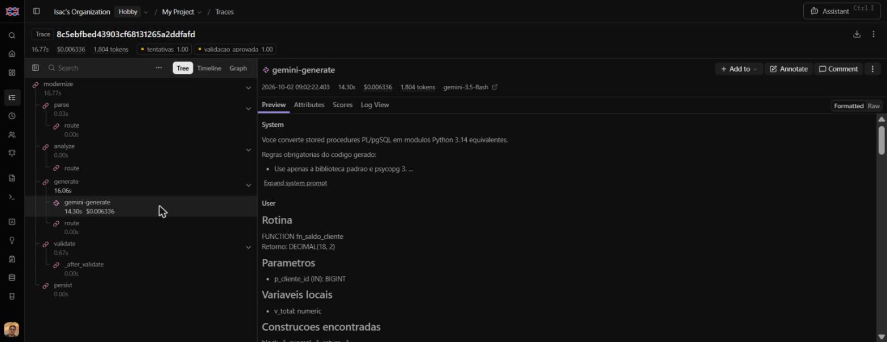

# Modernizer: pipeline híbrida PL/pgSQL → Python 3.14

Pipeline que recebe uma stored procedure PL/pgSQL e devolve um módulo Python 3.14
equivalente, com um relatório das decisões e validações. É híbrida: etapas
determinísticas (parsing, análise, validação) cercam uma etapa de LLM (geração).

## Como funciona


| Nó | Tipo | O que faz |
|---|---|---|
| `parse` | regras | Extrai assinatura (sqlglot) e árvore procedural (pglast) |
| `analyze` | regras | Conta construções, lista tabelas e funções chamadas, e marca riscos de tradução com uma orientação para cada um |
| `generate` | LLM | Gera o módulo Python a partir de um prompt montado com as saídas dos dois nós anteriores |
| `validate` | regras | Sintaxe (`ast.parse`), estrutura, lint (ruff) e execução em banco de teste |
| `persist` | regras | Grava a execução em `modernization_history`, qualquer que seja o desfecho |

O estado do grafo é um `TypedDict` (`src/modernizer/graph/state.py`). Todo caminho
termina em `persist`, o que garante o registro de sucessos, falhas e parciais.

Quando a validação reprova, o grafo volta para `generate` com o código rejeitado e
os erros no prompt, até 3 tentativas.

## Como executar

Pré-requisitos: Docker, Python 3.14, [uv](https://docs.astral.sh/uv/) e uma chave
do Google AI Studio.

```bash
cp .env.example .env        # preencha GEMINI_API_KEY
docker compose up -d        # Postgres: bancos modernizer (histórico) e legacy (teste)
uv sync
uv run langgraph dev        # servidor em http://127.0.0.1:2024
```

| Variável | Uso                                                    |
|---|--------------------------------------------------------|
| `GEMINI_API_KEY` | Chave do Google AI Studio                              |
| `MODERNIZER_MODEL` | Modelos em ordem de preferência, separados por vírgula |
| `DATABASE_URL` | Banco do histórico                                     |
| `TEST_DATABASE_URL` | Banco de teste da validação por execução (opcional)    |
| `LANGFUSE_SECRET_KEY` | Chave do Langfuse                                      |
| `LANGFUSE_PUBLIC_KEY` | Chave publica do langfuse                              |
| `LANGFUSE_BASE_URL` | Url base do langfuse                                   |

Endpoints:

- `GET /health` devolve `{"status": "ok"}`
- `POST /modernize` recebe `{"source_code": "...", "schema_ddl": "...", "dialect": "postgres"}`
  e devolve `id`, `status`, `generated_code` e `report`

Para rodar os Anexos B a F e salvar em `results/`:

```bash
uv run python scripts/run_samples.py
```

## Resultados

Código gerado e relatório de cada anexo estão em `results/`.

| Anexo | Rotina | Status | Checks |
|---|---|---|---|
| B | `fn_saldo_cliente` | sucesso | sintaxe, estrutura, lint |
| C | `sp_atualizar_status_contas_inativas` | sucesso | sintaxe, estrutura, lint |
| D | `sp_transferir_entre_contas` | sucesso | + execução |
| E | `sp_processar_lote_taxas` | sucesso | + execução |
| F | `sp_relatorio_mensal_cliente` | sucesso | sintaxe, estrutura, lint |

## Decisões técnicas

**Parsing com duas bibliotecas.** Uma procedure tem duas camadas. O sqlglot extrai
bem a assinatura (nome, modo e tipo dos parâmetros, retorno) e é multi-dialeto, mas
trata o corpo como texto. O pglast é o parser real do PostgreSQL e devolve a árvore
procedural (`IF`, `LOOP`, cursores, `EXCEPTION`), mas perde a precisão dos tipos.
Uso cada um no que faz melhor. Descartei o sqlparse por ser apenas um tokenizador.

**SQL fica no banco, controle vai para o Python.** Operações sobre dados continuam
em SQL parametrizado, enviadas com psycopg 3. Validações, exceções, transação e
logs passam para o Python. Reescrever consultas em laços criaria N+1; manter tudo
em SQL não seria modernização. Escolhi psycopg em vez de SQLAlchemy por ser mais
fino: transação e savepoint explícitos, `NUMERIC` como `Decimal`.

**Riscos detectados por regras, não pelo LLM.** A análise tem uma tabela de regras
(`dialects/postgres.py`): cursor em laço, bloco `EXCEPTION`, `FOR UPDATE`, parâmetros
OUT, CTE recursiva, `NUMERIC`, JSONB e outras. Cada risco leva uma orientação que
entra no prompt. O LLM recebe a instrução pronta em vez de precisar notar o problema.

**Validação por execução.** Sintaxe e lint aprovam código que não roda. Durante o
desenvolvimento, módulos com status de sucesso quebravam em tempo de execução
(`Decimal` em JSON, parâmetro sem tipo em `jsonb_build_object`, cursor reutilizado
dentro do laço). A validação passou a executar a função contra um banco de teste,
com argumentos derivados dos tipos dos parâmetros, em transação sempre desfeita. O
erro de execução volta para o LLM na tentativa seguinte.

**Provedor de LLM atrás de uma interface.** O nó conhece apenas `LLMProvider`
(`llm/base.py`). Trocar de modelo ou de fornecedor é escrever uma classe com o
método `generate` e registrá-la; grafo, prompt e validação não mudam. Os testes
usam essa mesma interface para substituir o LLM por um objeto com respostas fixas.

**Gemini (linha Flash) como modelo.** O critério foi custo: a API do Gemini tem
nível gratuito, o que permite a qualquer pessoa reproduzir o projeto sem cartão.
Uso a saída estruturada da API (JSON com `code` e `decisions`), que elimina a
extração de código de dentro de texto livre. O preço dessa escolha apareceu no
desenvolvimento: o nível gratuito tem cota diária por modelo, responde 503 com
frequência e não inclui a linha Pro. Por isso o provedor aceita uma lista de
modelos em ordem de preferência (`MODERNIZER_MODEL`), tenta o seguinte em caso de
sobrecarga ou cota esgotada e espera entre as rodadas. Modelos menores (Flash
Lite) geraram código com erro de sintaxe e de execução, então ficam fora da
lista. Com orçamento, eu avaliaria um modelo mais forte para os Anexos E e F
usando a métrica de equivalência como critério de comparação.

**Dialetos como plugins.** `Dialect` define `parse` e `analyze`. Suportar T-SQL ou
PL/SQL é criar uma classe e registrá-la; os nós não mudam.

**Banco.** `id` UUID (não expõe volume nem é adivinhável), `generated_code` anulável
(falhas também são gravadas), `report` em JSONB, `status` com `CHECK`, `created_at`
com fuso e índice para consultas das execuções recentes.

**Outras escolhas.**
- `uv` para dependências: instalação rápida e `uv.lock` versionado, para builds
  reproduzíveis.
- `psycopg[binary]`: traz a `libpq` embutida, sem exigir o cliente do Postgres
  instalado na máquina.
- `ruff` como dependência de execução, e não só de desenvolvimento: a pipeline o
  usa para validar o código gerado.
- `langchain` entra apenas porque a integração do Langfuse com o LangGraph o
  exige; o projeto não usa suas abstrações de LLM.
- Banco de teste (`legacy`) separado do banco de histórico: a validação executa
  código gerado, e não deve ter acesso aos dados da aplicação.

## Pontos de tradução observados

- **Anexo D:** no original, o `INSERT` de log dentro do `EXCEPTION` é desfeito pelo
  `RAISE` seguinte, então o log de erro nunca persiste. A tradução reproduz esse
  comportamento. Em produção, eu gravaria o log em uma conexão separada.
- **Anexo D:** com conta de destino inexistente, o original compara `NULL <> 'ATIVA'`,
  que resulta em `NULL`, e quem barra é a chave estrangeira. O Python barra antes,
  com a mensagem de contas inativas.
- **Anexo E:** o cursor com consulta por linha virou uma única consulta das taxas
  vigentes. Cada atribuição a variável `NUMERIC(18,2)` arredonda, e a tradução
  replica isso. Comparei Python e procedure original no mesmo banco de teste: mesmas
  tarifas, saldos e logs para o cenário de `samples/seed_teste.sql`.
- **Anexo F:** o `RAISE` de período inválido está dentro do bloco com
  `WHEN OTHERS`, então o original devolve a linha de fallback em vez de propagar o
  erro. A tradução mantém isso. A CTE recursiva continua em SQL.
- **Anexo F:** `fn_saldo_cliente` ainda é chamada no banco. O passo seguinte seria
  importar o módulo Python gerado para o Anexo B.

## Escalabilidade

- **Volume:** a pipeline é síncrona por requisição. O caminho é uma fila com
  workers, com o cliente consultando o resultado pelo `id`.
- **Custo:** cache por hash de `source_code` + modelo, evitando regerar o que já
  foi processado.
- **Conexões:** hoje abre uma por execução; trocar por pool (`psycopg_pool`).
- **Lotes:** procedures independentes podem ser processadas em paralelo.
- **Novos dialetos e modelos:** pelas interfaces `Dialect` e `LLMProvider`.

## Limitações conhecidas

- A validação por execução prova que o código roda com um conjunto de argumentos.
  Não prova equivalência com o original; a comparação foi feita manualmente em um
  cenário do Anexo E.
- O código gerado é executado com `exec` no processo do servidor. Em produção,
  precisa de isolamento (contêiner sem rede, usuário de banco restrito).
- O nível gratuito do Gemini tem cota diária por modelo e falhas 503 frequentes.
  A pipeline tenta modelos reserva e registra a falha quando todos esgotam.
- Geração por LLM não é determinística: duas execuções podem produzir códigos
  diferentes.
- Apenas PL/pgSQL está implementado.
- No Windows, o servidor do LangGraph precisa do pacote `colorama` (já incluído).

## Métrica de avaliação: equivalência comportamental

Para cada cenário (rotina + argumentos), a procedure original e o Python gerado
são executados sobre os mesmos dados de teste, cada um em uma transação desfeita.
O cenário é equivalente quando o retorno (ou a mensagem de erro) e o estado final
de `contas`, `transacoes` e `log_auditoria` são iguais.

```bash
curl -X POST http://127.0.0.1:2024/evaluate
```

A métrica avalia a geração bem-sucedida mais recente de cada rotina que estiver no
histórico. Em um banco novo, rode antes `uv run python scripts/run_samples.py`.

Os resultados ficam na tabela `evaluation_results`, ligados à execução avaliada.

**Resultado atual: 15 de 16 cenários (93,75%).** O cenário divergente é a
transferência para conta inexistente: o original falha por chave estrangeira e a
tradução falha antes, na validação de status. O estado do banco é igual.

**O que captura:** diferenças de retorno, de efeitos no banco e de mensagens de
erro. Nas versões anteriores do código gerado, apontou valor gravado como texto no
JSONB, erro propagado onde o original devolvia fallback, e arredondamento em um
passo em vez de dois.

**O que deixa de fora:** só enxerga o que os cenários exercitam. O caso do
arredondamento só passou a ser detectado depois que incluí um valor de borda nos
dados de teste. Também não mede desempenho nem concorrência (`FOR UPDATE`).

**Evolução em produção:** cenários gerados a partir de dados reais anonimizados,
testes baseados em propriedades para gerar entradas, execução em paralelo com o
legado comparando resultados (shadow mode), e a métrica como critério do laço de
correção, em vez de apenas relatório.


## Observabilidade com Langfuse

Cada chamada a `POST /modernize` gera um trace no Langfuse, com um span por nó do
grafo e, dentro de `generate`, o registro da chamada ao LLM (modelo, prompt,
resposta, tokens, custo e latência). Cada trace recebe dois scores:
`validacao_aprovada` e `tentativas`.



A integração usa o `CallbackHandler` do Langfuse para os nós do LangGraph e o
decorador `@observe` para a chamada ao Gemini, que é feita pelo SDK do Google e
não passa pelos callbacks. É opcional: sem `LANGFUSE_PUBLIC_KEY` e
`LANGFUSE_SECRET_KEY`, a pipeline roda sem tracing.

**Escolha: Langfuse Cloud.** A versão self-hosted atual exige seis serviços
(Postgres, ClickHouse, Redis, MinIO, web e worker). Para o escopo do desafio,
preferi a nuvem e deixei o destino configurável: apontar para uma instância
própria é trocar `LANGFUSE_BASE_URL`.

O custo dessa escolha é que os traces saem da máquina: prompts e código das
procedures são enviados a um serviço externo. Para código de cliente real, o
self-hosted seria obrigatório.


## Qualidade

```bash
uv run pytest          # 38 testes (36 sem o banco de teste; 2 exigem TEST_DATABASE_URL)
uv run ruff check .    # lint
```

Os testes do grafo usam um provedor de LLM falso, com respostas combinadas, e
substituem a gravação no banco. Isso permite testar o caminho feliz, a nova
tentativa (conferindo que os erros voltam no prompt), a desistência após 3
tentativas e a persistência de falhas, de forma determinística.
